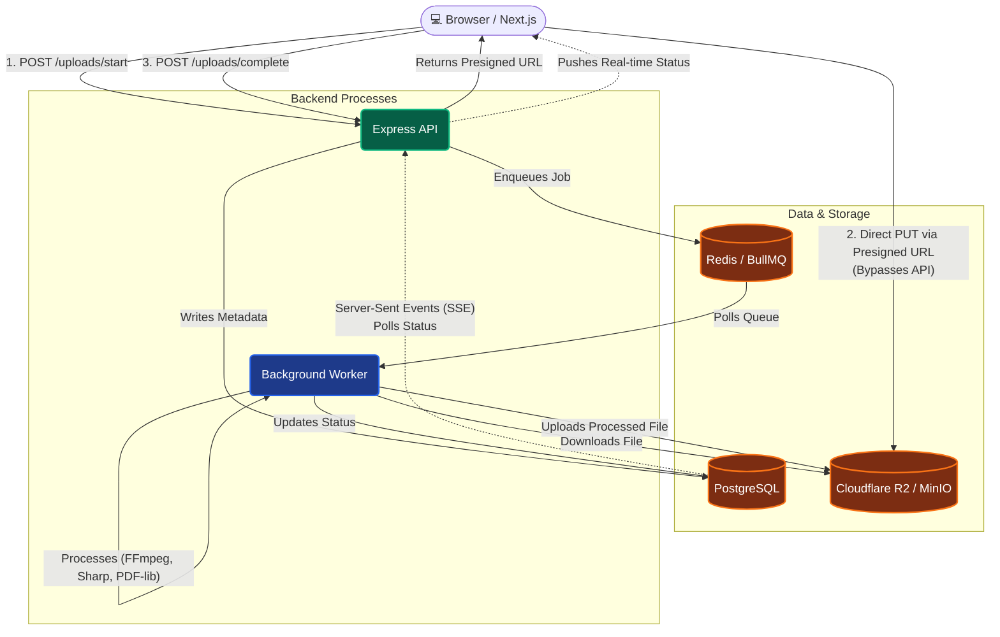

# FileFlow — System Architecture

> A distributed, async file-processing platform. Users upload images, PDFs, and videos through a React frontend. The backend validates and stores them, a queue system dispatches processing jobs to a worker process, and results are streamed back to the client in real time.

---

## Table of Contents

1. [High-Level Overview](#1-high-level-overview)
2. [Infrastructure (Docker)](#2-infrastructure-docker)
3. [Backend — Express API](#3-backend--express-api)
4. [Queue System — BullMQ](#4-queue-system--bullmq)
5. [Worker Process](#5-worker-process)
6. [File Processors](#6-file-processors)
7. [Dead-Letter Queue (DLQ)](#7-dead-letter-queue-dlq)
8. [Worker Metrics & Heartbeat](#8-worker-metrics--heartbeat)
9. [Storage — MinIO (S3-Compatible)](#9-storage--minio-s3-compatible)
10. [Database — PostgreSQL](#10-database--postgresql)
11. [Frontend — Next.js 14](#11-frontend--nextjs-14)
12. [Authentication & Authorization](#12-authentication--authorization)
13. [Real-Time Status — SSE](#13-real-time-status--sse)
14. [Admin Dashboard](#14-admin-dashboard)
15. [Complete Request Lifecycle](#15-complete-request-lifecycle)
16. [File & Folder Structure](#16-file--folder-structure)

---

## 1. High-Level Overview



```
┌─────────────────────────────────────────────────────────────────┐
│                        Browser (Next.js)                        │
│  /login  /register  /upload  /uploads  /admin                   │
└──────────────────────────┬──────────────────────────────────────┘
                           │ HTTP / SSE
                           ▼
┌─────────────────────────────────────────────────────────────────┐
│                   Express API  :4000                            │
│  Auth · Upload lifecycle · Admin routes · SSE stream            │
└────────┬──────────────────────────────────┬─────────────────────┘
         │ SQL (pg)                          │ BullMQ jobs
         ▼                                  ▼
┌─────────────────┐              ┌──────────────────────────────┐
│   PostgreSQL    │              │      Redis  :6379            │
│  users          │              │  image-processing queue      │
│  uploads        │              │  pdf-processing queue        │
└─────────────────┘              │  video-processing queue      │
                                 │  dlq queue                   │
                                 │  worker:heartbeat  (TTL 30s) │
                                 │  worker:metrics    (TTL 60s) │
                                 └──────────────┬───────────────┘
                                                │ BullMQ poll
                                                ▼
                                 ┌──────────────────────────────┐
                                 │       Worker Process         │
                                 │  imageProcessor  (c=10)      │
                                 │  pdfProcessor    (c=5)       │
                                 │  videoProcessor  (c=2)       │
                                 └──────────────┬───────────────┘
                                                │ GetObject / PutObject
                                                ▼
                                 ┌──────────────────────────────┐
                                 │    MinIO  :9000              │
                                 │  raw/{uploadId}/{file}       │
                                 │  processed/{uploadId}/output │
                                 └──────────────────────────────┘
```

The two key design choices:

- **The API and the Worker are separate Node.js processes.** They share no memory. They communicate only through Redis (via BullMQ queues) and PostgreSQL.
- **The client never polls.** It subscribes to a Server-Sent Events stream (`GET /uploads/:id/stream`) and the API pushes status changes as they happen.

---

## 2. Infrastructure (Docker)

Defined in `docker-compose.yaml`. Three services are containerised; the API and Worker run directly on the host machine in development.

| Container | Image | Port | Purpose |
|---|---|---|---|
| `filepipeline_postgres` | `postgres:15` | `5433→5432` | Persistent relational store |
| `filepipeline_redis` | `redis:7` | `6379` | BullMQ transport + worker telemetry |
| `filepipeline_minio` | `minio/minio` | `9000` (API) `9001` (console) | S3-compatible object storage |

Both `pgdata` and `miniodata` are Docker named volumes so data survives container restarts.

---

## 3. Backend — Express API

**Entry point:** `Backend/index.js`  
**Port:** `4000`  
**Module system:** ESM (`"type": "module"`)

### Middleware stack

```
express.json()   → parses request body as JSON
cors()           → allows requests from the Next.js dev server
requireAuth      → JWT verification (most routes)
requireAdmin     → email-allowlist check (admin routes only)
```

### Route map

| Method | Path | Auth | Description |
|---|---|---|---|
| `GET` | `/health` | None | Liveness probe |
| `POST` | `/auth/register` | None | Create account (bcrypt hash, store in `users`) |
| `POST` | `/auth/login` | None | Verify password → issue JWT (1 h expiry) |
| `POST` | `/uploads/start` | User | Validate file meta → create DB row (CREATED) → return presigned PUT URL |
| `POST` | `/uploads/complete` | User | Verify object in MinIO → mark UPLOADED → enqueue job |
| `GET` | `/uploads/:id` | User (owner) | Fetch single upload record |
| `GET` | `/uploads/:id/stream` | User (JWT query param) | SSE push stream until PROCESSED/FAILED |
| `GET` | `/uploads/:id/download` | User (owner) | **Stream** processed file through backend → triggers browser save dialog |
| `GET` | `/uploads` | User | List all uploads for the logged-in user |
| `DELETE` | `/uploads/:id` | User (owner) | Delete MinIO objects + DB row |
| `GET` | `/admin/uploads` | Admin | Paginated list of all uploads (filter by status) |
| `GET` | `/admin/uploads/:id` | Admin | Full detail + presigned raw & processed URLs |
| `DELETE` | `/admin/uploads/:id` | Admin | Hard-delete any upload |
| `GET` | `/admin/metrics` | Admin | Queue depths + worker heartbeat + metrics snapshot |
| `GET` | `/admin/failed` | Admin | Last 50 FAILED uploads from DB |
| `GET` | `/admin/dlq` | Admin | Jobs currently sitting in the DLQ |
| `POST` | `/admin/dlq/:jobId/replay` | Admin | Reset upload to UPLOADED, re-enqueue, remove from DLQ |
| `GET` | `/admin/users` | Admin | All users with aggregated upload stats |

### File upload flow (2-step, presigned PUT)

The browser **never** sends file bytes to the Express server. Instead:

```
1. POST /uploads/start
   └─ Backend creates DB row (status=CREATED)
   └─ Backend calls s3.getSignedUrl(PutObjectCommand) → 10 min URL
   └─ Returns { uploadId, presignedUrl }

2. Browser PUT presignedUrl  ← file bytes go directly to MinIO
   └─ MinIO stores as raw/{uploadId}/{filename}

3. POST /uploads/complete
   └─ Backend calls s3.HeadObject to confirm file arrived
   └─ UPDATE uploads SET status='UPLOADED'
   └─ enqueueUpload() → job lands in the correct BullMQ queue
```

This offloads all file-transfer bandwidth from the API process.

### Download streaming

`GET /uploads/:id/download` was deliberately changed from returning a presigned URL to **piping the S3 stream through Express**:

```javascript
const s3Res = await s3.send(new GetObjectCommand({ ... }));
res.setHeader("Content-Disposition", `attachment; filename*=UTF-8''${filename}`);
s3Res.Body.pipe(res);
```

**Why?** The browser's `download` attribute on `<a>` tags is ignored for cross-origin URLs (MinIO runs on port 9000, the frontend is on 3000). By streaming through the same-origin API (`localhost:4000`), the `Content-Disposition: attachment` header reliably triggers a save-file dialog.

---

## 4. Queue System — BullMQ

**File:** `Backend/src/queue.js`  
**Backed by:** Redis (ioredis connection)

Three dedicated queues, one per file type:

```
image-processing   →  imageProcessor
pdf-processing     →  pdfProcessor
video-processing   →  videoProcessor
```

All three share the same job defaults:

```javascript
const JOB_DEFAULTS = {
  attempts: 5,                              // up to 5 total tries
  backoff: { type: "exponential", delay: 2000 }, // 2s, 4s, 8s, 16s, 32s
  removeOnComplete: true,                   // don't clog Redis with old jobs
  removeOnFail: false,                      // keep failed jobs for inspection
};
```

**Routing logic** inside `enqueueUpload()`:

```javascript
if (mimeType.startsWith("image/"))     → imageQueue
if (mimeType === "application/pdf")    → pdfQueue
if (mimeType.startsWith("video/"))     → videoQueue
```

Separating queues by type means a flood of video jobs (slow, concurrency=2) cannot starve image jobs (fast, concurrency=10).

---

## 5. Worker Process

**Entry point:** `worker/index.js`  
**Runs as:** A separate `node` process — completely independent of the API.

### The `makeHandler(processor)` factory

Rather than writing the same boilerplate three times, all job lifecycle logic lives in one factory function. It wraps any processor with:

| Step | What happens |
|---|---|
| **Fetch** | Load the upload record from PostgreSQL |
| **Idempotency check** | If already PROCESSED, return early (safe to receive duplicate jobs) |
| **Optimistic lock** | `UPDATE uploads SET status='PROCESSING' WHERE status='UPLOADED'` — if this returns 0 rows another worker already claimed it, bail out |
| **Process** | Call the injected `processor(upload, uploadId)` function |
| **Commit** | `UPDATE uploads SET status='PROCESSED', processed_key=...` |
| **Metrics** | Call `recordComplete()` to update in-process counters |

### Three BullMQ Workers

```javascript
new Worker("image-processing", makeHandler(processImage), { concurrency: 10 })
new Worker("pdf-processing",   makeHandler(processPdf),   { concurrency: 5  })
new Worker("video-processing", makeHandler(processVideo), { concurrency: 2  })
```

Concurrency is tuned to CPU/IO cost:
- **Images** — pure CPU (sharp), lightweight, can run 10 at once
- **PDFs** — moderate memory (pdf-lib), 5 concurrent
- **Videos** — ffmpeg spawns a child process and is I/O heavy; only 2 at once to avoid thrashing

### `onFailed(queueName)` handler

Attached to every worker. On each failure:

- Logs the error with attempt count
- If **not final** — calls `recordRetry()`, BullMQ will retry with exponential backoff
- If **final** (attempts exhausted):
  - Marks upload `FAILED` in PostgreSQL with the error message
  - Calls `moveToDLQ(job, err)` to copy the payload to the DLQ
  - Calls `recordDLQ()` and `recordFailed()` for metrics

---

## 6. File Processors

Each processor lives in `worker/src/processors/` and follows the same contract:

```typescript
async function processorXxx(upload, uploadId): Promise<{ processedKey: string }>
```

They receive the raw upload record (with `raw_key`) and must return the `processedKey` in MinIO where output was stored.

### Image Processor (`imageProcessor.js`)

Uses **sharp** (libvips bindings).

```
1. GetObject(raw_key) from MinIO → stream → Buffer
2. sharp(buffer).resize({ width: 800 }).png().toBuffer()
3. PutObject → processed/{uploadId}/output.png
```

Output is always PNG regardless of input format (JPG, PNG, WebP, etc.), resized to max 800px wide while preserving aspect ratio.

### PDF Processor (`pdfProcessor.js`)

Uses **pdf-lib**.

```
1. GetObject(raw_key) → Buffer
2. PDFDocument.load(buffer, { ignoreEncryption: true })
3. Stamp metadata: Producer="FileFlow Processor v1", creation/modification dates
4. pdfDoc.save({ useObjectStreams: true }) → compressed bytes
5. PutObject → processed/{uploadId}/output.pdf
   (with x-page-count in S3 metadata)
```

The processing is intentionally lightweight — it re-saves the document (which compresses with object streams) and stamps provenance metadata. A real pipeline might add watermarks, extract text, etc.

### Video Processor (`videoProcessor.js`)

Uses **fluent-ffmpeg** with the bundled `@ffmpeg-installer/ffmpeg` binary.

```
1. GetObject(raw_key) → Buffer → write to OS tmpdir as inputPath
2. ffmpeg(inputPath)
     -c:v libx264 -preset fast -crf 23
     -vf scale=-2:720          ← max 720p, preserve aspect ratio
     -c:a aac -b:a 128k
     -movflags +faststart      ← MOOV atom at front for HTTP streaming
   → outputPath (.mp4)
3. ffmpeg(inputPath).screenshots({ timestamps:["1"] }) → thumbPath (.jpg)
4. PutObject → processed/{uploadId}/output.mp4
5. PutObject → processed/{uploadId}/thumbnail.jpg
6. Cleanup tmpdir files
```

The `-movflags +faststart` flag is important — it moves the MP4 MOOV atom to the beginning of the file so browsers can start playing before the full file is downloaded.

### Shared utilities

| File | Purpose |
|---|---|
| `worker/src/utils/streamToBuffer.js` | Collects a Node.js Readable stream into a single `Buffer` |
| `worker/src/utils/s3WithTimeout.js` | Wraps `s3.send()` with a timeout so a stalled MinIO call can't hang a worker forever |
| `worker/src/s3.js` | Configures `S3Client` with `forcePathStyle: true` (required for MinIO) |

---

## 7. Dead-Letter Queue (DLQ)

**Files:** `Backend/src/dlq.js` and `worker/src/dlq.js` (identical logic, separate copies because the two processes have separate `node_modules` trees)

When a job fails all 5 retry attempts, the worker calls `moveToDLQ(job, err)`:

```javascript
await dlqQueue.add("dead-letter", {
  originalQueue: job.queueName,   // which queue it came from
  originalJobId: job.id,
  payload:       job.data,        // original { uploadId, rawKey, mimeType }
  failedAt:      new Date().toISOString(),
  errorMessage:  String(err.message),
  errorStack:    err.stack,
  attemptsMade:  job.attemptsMade,
}, { jobId: `dlq-${job.id}` });   // stable ID prevents duplicates
```

DLQ jobs are kept indefinitely (`removeOnComplete: false`, `removeOnFail: false`) and have `attempts: 1` so they never auto-retry.

### Replaying a DLQ job

`POST /admin/dlq/:jobId/replay`:

```
1. Load the DLQ job from Redis
2. Extract { uploadId, rawKey, mimeType } from job.data.payload
3. UPDATE uploads SET status='UPLOADED', error_message=NULL
4. enqueueUpload({ uploadId, rawKey, mimeType }) → back to normal queue
5. job.remove() → remove from DLQ
```

This is a full round-trip: the upload goes back to `UPLOADED`, gets routed to the right queue, and the worker picks it up as if it were a fresh job.

---

## 8. Worker Metrics & Heartbeat

**File:** `worker/src/metrics.js`

The worker process has no HTTP server. To expose its internal state to the admin dashboard, it pushes two Redis keys every 10 seconds:

| Redis key | TTL | Contents |
|---|---|---|
| `worker:heartbeat` | 30 s | `Date.now()` timestamp |
| `worker:metrics` | 60 s | JSON snapshot of all counters |

The API's `GET /admin/metrics` reads these keys and includes them in the response. The admin dashboard shows a "Worker Alive" indicator that turns red if the heartbeat is older than 30 seconds.

**Metric counters** are tracked per type bucket (`image`, `pdf`, `video`):

```
jobs_started       jobs_completed     jobs_failed
jobs_retried       dlq_moved
duration_ms_total  duration_ms_count  → avg_duration_ms
size_bytes_total   size_bytes_count   → avg_size_bytes
```

All counters are **in-memory only** — they reset when the worker restarts. They're intended for operational visibility, not long-term analytics.

---

## 9. Storage — MinIO (S3-Compatible)

MinIO implements the AWS S3 API. The code uses `@aws-sdk/client-s3` — no MinIO-specific SDK needed.

**Key pattern:**

```
raw/{uploadId}/{originalFilename}         ← uploaded by the browser (presigned PUT)
processed/{uploadId}/output.png|pdf|mp4   ← written by the worker
processed/{uploadId}/thumbnail.jpg        ← written by videoProcessor only
```

The `forcePathStyle: true` option is required because MinIO uses path-style URLs (`localhost:9000/bucket/key`) rather than subdomain-style (`bucket.s3.amazonaws.com/key`).

In production you would swap the `S3_ENDPOINT` env var to point at a real AWS S3 or hosted MinIO instance with no other code changes.

---

## 10. Database — PostgreSQL

**Database name:** `filepipeline`  
**Connection:** `pg.Pool` (connection pooling) in both the API and the worker.

### Tables

**`users`**
```sql
id            UUID PRIMARY KEY
email         TEXT UNIQUE NOT NULL
password_hash TEXT NOT NULL
created_at    TIMESTAMPTZ DEFAULT NOW()
```

**`uploads`**
```sql
id                UUID PRIMARY KEY
user_id           UUID REFERENCES users(id)
original_filename TEXT NOT NULL
mime_type         TEXT NOT NULL
size_bytes        BIGINT
status            TEXT NOT NULL  -- CREATED | UPLOADED | PROCESSING | PROCESSED | FAILED
raw_key           TEXT           -- MinIO key for the original file
processed_key     TEXT           -- MinIO key for the output file (set by worker)
error_message     TEXT           -- set on FAILED
created_at        TIMESTAMPTZ DEFAULT NOW()
updated_at        TIMESTAMPTZ DEFAULT NOW()
```

### Status state machine

```
CREATED ──→ UPLOADED ──→ PROCESSING ──→ PROCESSED
                │                            ↑
                └──────────────────→ FAILED ─┘ (via DLQ replay → back to UPLOADED)
```

- `CREATED` — DB row exists, presigned URL issued, file not yet confirmed in MinIO
- `UPLOADED` — file confirmed in MinIO, job enqueued
- `PROCESSING` — worker acquired optimistic lock
- `PROCESSED` — worker wrote output to MinIO, `processed_key` is set
- `FAILED` — all retries exhausted, `error_message` is set

The optimistic lock (`UPDATE ... WHERE status='UPLOADED'`) prevents two worker instances from processing the same upload simultaneously.

---

## 11. Frontend — Next.js 14

**Framework:** Next.js 14 App Router  
**Language:** TypeScript (strict mode)  
**Styling:** Custom CSS in `globals.css` (no UI library)  
**Font:** Poppins (Google Fonts, weights 400/500/600/700)

### Pages

| Route | File | Purpose |
|---|---|---|
| `/` | `app/page.tsx` | Landing / home |
| `/register` | `app/register/page.tsx` | Account creation form |
| `/login` | `app/login/page.tsx` | Login form → stores `token` + `isAdmin` in localStorage |
| `/upload` | `app/upload/page.tsx` | Active upload page with real-time SSE progress |
| `/uploads` | `app/uploads/page.tsx` | "My Files" — history of all uploads, download/delete |
| `/admin` | `app/admin/page.tsx` | Admin dashboard (guarded by `isAdmin` flag) |

### Component tree

```
layout.tsx (Poppins font, Topbar)
├── Topbar.tsx                    — nav: Upload · My Files · Admin · Logout
│
├── upload/page.tsx               — orchestrator: state + SSE + upload logic
│   ├── DropZone.tsx              — drag-and-drop file input area
│   └── FileRow.tsx               — per-file row: progress bar, step tracker, SSE badge
│       └── FileIcon.tsx          — SVG icon by MIME type
│
├── uploads/page.tsx              — My Files list with delete modal
│
└── admin/page.tsx                — thin orchestrator, tab switcher
    ├── OverviewTab.tsx           — queue cards, worker health, metric table
    ├── FailedTab.tsx             — FAILED uploads table
    ├── DLQTab.tsx                — DLQ table + replay buttons
    ├── UploadsTab.tsx            — all uploads, status filter, pagination
    ├── UsersTab.tsx              — users with upload stats
    ├── UploadDetailPanel.tsx     — slide-over panel with preview + download
    ├── DeleteConfirmModal.tsx    — confirm modal
    └── AdminIcons.tsx            — all SVG icon components
```

### API client (`src/lib/api.ts`)

A thin wrapper around `fetch`. All requests go to `http://localhost:4000`. It:
- Reads the JWT from `localStorage` and attaches `Authorization: Bearer <token>`
- Handles 401 responses by clearing localStorage and redirecting to `/login`
- Throws the parsed JSON error body so callers can display `{ error: "..." }`

### Shared types and utilities

| File | Purpose |
|---|---|
| `src/types/admin.ts` | All admin-page TypeScript interfaces (`AdminMetrics`, `AdminUpload`, `AdminUser`, etc.) |
| `src/types/upload.ts` | Upload page interfaces, constants (`STEPS`, `ACCEPTED`), pure helper functions |
| `src/lib/formatters.ts` | `fmtBytes`, `fmtDate`, `fmtMs`, `ago` — formatting utilities used across pages |
| `src/components/StatusBadge.tsx` | Shared `<StatusBadge status="PROCESSED" />` component |

---

## 12. Authentication & Authorization

### JWT

On login the API signs a JWT with:

```javascript
jwt.sign(
  { userId, email, isAdmin },
  process.env.JWT_SECRET,
  { expiresIn: "1h" }
)
```

The token is stored in `localStorage`. Every API request includes it as `Authorization: Bearer <token>`.

The `requireAuth` middleware verifies and decodes it on every protected route, populating `req.user`.

### Admin role

There is no admin database column. Instead, `ADMIN_EMAILS` is a comma-separated env var:

```
ADMIN_EMAILS=alice@example.com,bob@example.com
```

The `requireAdmin` middleware checks if `req.user.email` is in that set. This means:
- Promoting someone to admin = add their email to the env var + restart
- Revoking admin = remove from env var + restart
- No DB migration needed

The frontend reads the `isAdmin` flag returned from `/auth/login` and stores it in localStorage to show/hide the Admin nav link.

---

## 13. Real-Time Status — SSE

`GET /uploads/:id/stream` implements **Server-Sent Events** rather than WebSockets because SSE is one-directional (server → client only) and works over plain HTTP/1.1.

```javascript
// Auth via query param because EventSource cannot set custom headers
const token = req.query.token;

// SSE headers
res.setHeader("Content-Type", "text/event-stream");
res.setHeader("Cache-Control", "no-cache");
res.setHeader("X-Accel-Buffering", "no"); // disable nginx buffering

// Poll Postgres every 1.5s, push only when status changes
let lastStatus = null;
setInterval(async () => {
  const row = await pool.query("SELECT status FROM uploads WHERE id=$1", [id]);
  if (row.status !== lastStatus) {
    lastStatus = row.status;
    res.write(`data: ${JSON.stringify({ upload: row })}\n\n`);
  }
  if (TERMINAL_STATUSES.has(row.status)) {
    res.write(`data: ${JSON.stringify({ done: true })}\n\n`);
    res.end();
  }
}, 1500);

req.on("close", cleanup); // clean up timer when client disconnects
```

The frontend (`upload/page.tsx`) opens one `EventSource` per file immediately after calling `/uploads/complete`. When the `done: true` event arrives, the SSE connection is closed.

---

## 14. Admin Dashboard

`/admin` is a single-page dashboard with five tabs:

| Tab | Data source | What it shows |
|---|---|---|
| **Overview** | `GET /admin/metrics` | Queue depths (waiting/active/failed/delayed), worker alive indicator, per-type processing stats (avg duration, avg file size, job counts) |
| **Failed** | `GET /admin/failed` | Last 50 uploads with `status='FAILED'`, including error message |
| **DLQ** | `GET /admin/dlq` | Jobs in the dead-letter queue; each has a **Replay** button |
| **All Uploads** | `GET /admin/uploads` | Paginated table of all uploads across all users; filter by status; click a row to open the detail panel |
| **Users** | `GET /admin/users` | All users with total/processed/failed upload counts and total storage used |

The **Upload Detail Panel** is a slide-over drawer showing raw + processed presigned preview URLs, full metadata, and a delete button.

---

## 15. Complete Request Lifecycle

Here is what happens from the moment a user drops a file on the page to the moment they can download it:

```
① User drops file.png onto DropZone
   └─ addFiles() creates a FileEntry { localId, file, status:"idle" }

② uploadEntry() is called
   └─ POST /uploads/start → { uploadId, presignedUrl }
   └─ status → "uploading"
   └─ PUT presignedUrl (browser → MinIO directly, Express not involved)
   └─ status → "completing"

③ POST /uploads/complete
   └─ Backend: HeadObject confirms file in MinIO
   └─ Backend: UPDATE status='UPLOADED'
   └─ Backend: enqueueUpload() → imageQueue.add("process-image", { uploadId, rawKey, mimeType })
   └─ status → "queued"

④ EventSource opens GET /uploads/{id}/stream?token=...
   └─ SSE polling begins every 1.5s

⑤ BullMQ worker picks up the job
   └─ UPDATE status='PROCESSING' (optimistic lock)
   └─ SSE push: status → "processing"
   └─ sharp: download raw, resize to 800px, convert to PNG, upload processed
   └─ UPDATE status='PROCESSED', processed_key='processed/{id}/output.png'

⑥ SSE push: status → "processed" + done:true
   └─ EventSource closes
   └─ FileRow shows green "PROCESSED" badge + Download button

⑦ User clicks Download
   └─ fetch GET /uploads/{id}/download (with Authorization header)
   └─ Backend: GetObjectCommand → stream → res.pipe()
   └─ Browser receives blob → URL.createObjectURL → <a download> click
   └─ OS save-file dialog appears
```

If step ⑤ fails: BullMQ retries up to 4 more times (exponential backoff: 2s, 4s, 8s, 16s). If all 5 fail, the job moves to the DLQ and the upload is marked `FAILED`. An admin can replay it from the dashboard.

---

## 16. File & Folder Structure

```
file-processing-pract/
│
├── docker-compose.yaml            # PostgreSQL, Redis, MinIO
│
├── Backend/
│   ├── index.js                   # Express app, all 17 routes (756 lines)
│   ├── package.json               # ESM, dependencies
│   ├── .gitignore
│   └── src/
│       ├── queue.js               # BullMQ Queue instances + enqueueUpload()
│       ├── dlq.js                 # DLQ Queue + moveToDLQ()
│       ├── s3.js                  # S3Client (MinIO) singleton
│       └── logger.js              # Structured JSON logger
│
├── worker/
│   ├── index.js                   # Worker process: 3 Workers + heartbeat (241 lines)
│   ├── package.json               # ESM, separate node_modules
│   ├── .gitignore
│   └── src/
│       ├── dlq.js                 # Duplicate of Backend/src/dlq.js (separate process)
│       ├── s3.js                  # S3Client singleton (same config)
│       ├── logger.js              # Structured JSON logger
│       ├── metrics.js             # In-process counters + Redis publisher
│       ├── processors/
│       │   ├── imageProcessor.js  # sharp: resize → PNG
│       │   ├── pdfProcessor.js    # pdf-lib: re-save + stamp metadata
│       │   └── videoProcessor.js  # ffmpeg: transcode → 720p MP4 + thumbnail
│       └── utils/
│           ├── streamToBuffer.js  # Readable → Buffer helper
│           └── s3WithTimeout.js   # s3.send() with timeout wrapper
│
└── frontend/
    ├── next.config.ts
    ├── tsconfig.json
    └── src/
        ├── app/
        │   ├── layout.tsx         # Root layout: Poppins font + Topbar
        │   ├── globals.css        # All styles (no UI library)
        │   ├── page.tsx           # Landing page
        │   ├── login/page.tsx     # Login form
        │   ├── register/page.tsx  # Register form
        │   ├── upload/page.tsx    # Active upload orchestrator
        │   ├── uploads/page.tsx   # My Files history page
        │   └── admin/page.tsx     # Admin dashboard orchestrator
        ├── components/
        │   ├── Topbar.tsx         # Navigation bar
        │   ├── StatusBadge.tsx    # Shared status badge
        │   ├── upload/
        │   │   ├── DropZone.tsx   # Drag-and-drop file input
        │   │   ├── FileRow.tsx    # Per-file progress row
        │   │   └── FileIcon.tsx   # SVG icon by MIME type
        │   └── admin/
        │       ├── AdminIcons.tsx        # All admin SVG icons
        │       ├── OverviewTab.tsx       # Queue + worker health
        │       ├── FailedTab.tsx         # Failed uploads
        │       ├── DLQTab.tsx            # Dead-letter queue
        │       ├── UploadsTab.tsx        # All uploads table
        │       ├── UsersTab.tsx          # Users table
        │       ├── UploadDetailPanel.tsx # Slide-over detail view
        │       └── DeleteConfirmModal.tsx# Confirm modal
        ├── lib/
        │   ├── api.ts             # fetch wrapper with auth + 401 handling
        │   └── formatters.ts      # fmtBytes, fmtDate, fmtMs, ago
        └── types/
            ├── admin.ts           # Admin page TypeScript interfaces
            └── upload.ts          # Upload page types + helpers
```
